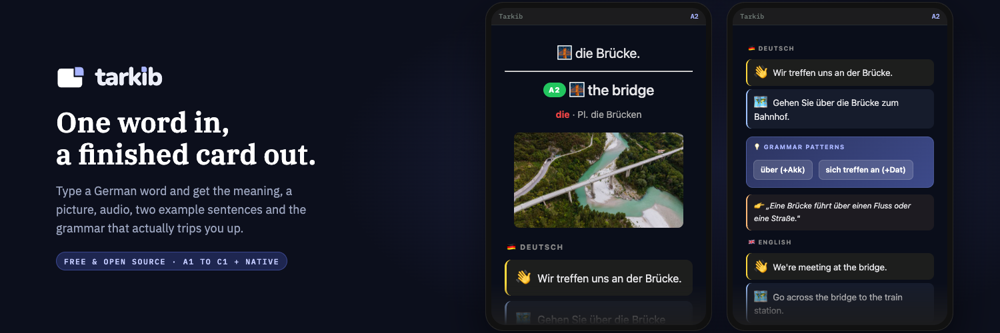
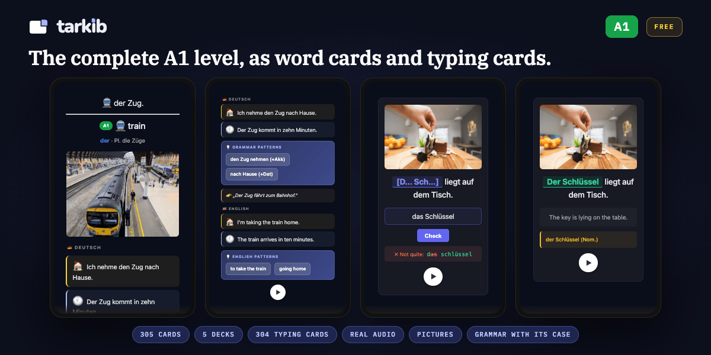

# Tarkib: AI German flashcards for Anki

### The card that makes it stick.

> A free, open-source Anki add-on that turns one typed word into a full language card: meaning and a natural translation, a related image, memory emojis, audio, a casual and a formal example sentence, and the grammar that actually matters.

## The story

I've been using Anki for a few years to learn languages, especially German. I found a card format that works for me. **Front:** the word. **Back:** the meaning, a related image, a couple of emojis that help me remember it, audio, and two example sentences, one casual and one formal. Verbs always come with their preposition and case, like "warten auf" with the Akkusativ, because that is what you need when you speak.

The problem was making those cards. I typed everything in by hand, made the audio with a separate TTS tool, searched for an image and uploaded it, then asked an AI if my example sentence was even correct. One card took me ten to fifteen minutes.

As a developer, I wanted to use that skill to build something that helps me with this. So I started planning and thinking about a tool that could do the slow parts for me, and after a while it turned into this add-on.

Now I type one word, pick the level (A1 to C1, or Native for real spoken German) and the language I want for the translation on the back, even a second one if I like. Tarkib builds the whole card with the image, audio, example sentences and grammar, plus a cloze card where I type the missing word, if I want one. I still check each card myself.

## What you get

Type one word, get a full card:

- **Meaning and a natural translation**, in your helper language.
- **A casual and a formal example sentence**, each translated, so you learn when to use the word, not just what it means.
- **The grammar learners actually trip on:** article, plural, and (from B1) genitive for nouns, correct strong-verb past forms (so `fahren` gives `fuhr`, not a made-up `fahrte`), and for verbs the preposition with its case, like `warten auf` with Akkusativ.
- **A real image and a couple of memory emojis** tied to the word, so it has something to hook onto.
- **Audio** for the German and the translation, so you hear how the sentences sound.
- **An optional fill-in-the-blank (cloze) companion card**, to practice producing the word, not just recognizing it.
- **Sentences that match your level:** A1 to C1, plus a "Native" style for real spoken German.

## Translation languages

The helper text under the German can be any of **24 languages** (English by default). Optionally add a **second language** on every card, for example English plus Arabic for a bilingual learner.

Every language gets a natural Microsoft voice, chosen in **Settings, Languages**. Press **▶** next to a voice to hear a sample sentence before you decide.

## How it works

1. Install it from [AnkiWeb](https://ankiweb.net/shared/info/83323714) with the code `83323714`, then open it: **Tools → "Add a card with Tarkib"**, or `Ctrl+Shift+G`, or the Tarkib button in the editor, the Decks screen, or the top toolbar.
2. Type one German word or phrase, pick a deck and a level.
3. Click **Add**. About 15 to 20 seconds later the card (and the optional cloze companion) is in your collection, with image and audio.

Create on the desktop, study anywhere: the cards are normal Anki notes and media, so they sync and study fully on AnkiDroid and iOS like any other deck. The generator runs on Anki Desktop only (the mobile apps do not run add-ons).

## Ready-made German decks (A1 is free)

Rather not make the cards yourself? I made German decks, A1 to C1, in the same card format. Every word has a picture, German audio, casual and formal sentences, and the grammar pattern with its case when the sentence has one, like `fahren mit (+Dat)`. Nouns come with their article, and the plural when there is one. Nearly every word also has a typing card checked letter by letter. Meanings in English or Arabic. The cards were made with Claude, Anthropic's AI, then reviewed and fixed by a person, card by card, over several rounds. The audio comes from a licensed voice service, and the pictures are licensed too.

**[Get the whole A1 level for free](https://ko-fi.com/s/ab96fd15d8)** (305 word cards plus 304 typing cards). The English edition is also on [AnkiWeb Shared Decks](https://ankiweb.net/shared/info/255858872). Other levels are in [my Ko-fi shop](https://ko-fi.com/tarkib/shop). You could build them yourself with Tarkib, but A2 to C1 is 1,814 word cards: on the free Groq plan, which allows a few dozen cards a day, that takes well over a month, and every card still needs checking. The paid levels are those cards already made and reviewed.

## Install

**From AnkiWeb (recommended).** In Anki: **Tools → Add-ons → Get Add-ons**, paste the code **`83323714`**, and restart Anki. The add-on page is [Tarkib on AnkiWeb](https://ankiweb.net/shared/info/83323714).

**Manually (latest build).** Clone this repository and run `python3 build.py`, then double-click `out/tarkib.ankiaddon` to install it into Anki. Or download the ZIP from GitHub, unzip it, rename the folder to `tarkib`, and move it into your Anki add-ons folder, then restart Anki:

- **macOS:** `~/Library/Application Support/Anki2/addons21/`
- **Linux:** `~/.local/share/Anki2/addons21/`
- **Windows:** `%APPDATA%\Anki2\addons21\`

Then open **Settings** and paste your free keys (see the next section for how to get them).

## Get your free keys (about 5 minutes)

Tarkib uses two free keys:

- **Groq** (required): the AI that writes your cards. Free, no credit card.
- **Pexels** (optional, recommended): photos for your cards. Free. Without an image key, cards use free Openverse images, which often have no good match.

### Groq: the AI that writes your cards

1. Go to <https://console.groq.com> and sign in with Google, GitHub or your email (Groq emails you a login link).
2. In the left menu click **API Keys**, or open <https://console.groq.com/keys>.
3. Click **Create API Key**, type any name (for example `Anki`), complete the "verify you are human" check if it appears, and click **Submit**.
4. Click **Copy**. The key starts with `gsk_` and is shown only once, so paste it into Anki right away. If you lose it, just create a new one.
5. In Anki open the add-on (**Tools → Add a card with Tarkib**), click **Settings…**, keep the preset **Groq (OpenAI-compatible)**, paste the key into **API key**, and click **Save**.

The free plan has a daily limit on tokens as well as requests, which works out to a few dozen cards a day with the default model. If you reach it, the add-on tells you, and you can continue the next day or switch to another model in Settings.

### Pexels: photos for your cards

1. Create a free account at <https://www.pexels.com/join-consumer/> (Google or email), or log in.
2. Open <https://www.pexels.com/api/key/>, or go to <https://www.pexels.com/api/> and click **Your API Key**.
3. Fill in the short form about your project. An honest short answer is enough, for example name "My Anki flashcards" and description "Pictures for my personal vocabulary cards". The website can stay empty. Accept the terms and click **Generate API Key**. (The form may look a little different.)
4. Your key appears right away. Copy it. You can see it again any time at <https://www.pexels.com/api/key/>.
5. In Anki open **Settings…**, go to the **Images** tab, paste it into **Pexels key**, and click **Save**.

The free Pexels key allows 200 searches an hour, far more than you will need. Prefer another source? A free Pixabay key works too: log in at Pixabay, open <https://pixabay.com/api/docs/> and copy the key shown there into **Pixabay key**.

When both keys are in, click **Test keys** once in Settings to check them. Then type a word and click **Add**.

## Cost and keys (bring your own key)

Tarkib is **free and open source**. It uses your own API key, and the default is a **free model on Groq**, so for most people it costs nothing. You can point it at a paid model you already have a key for if you prefer. An optional image key (Pexels) gives the cards their photos. Without one, the add-on tries a free keyless source, which often finds no picture.

**Requirements:** pure Python, no compiled dependencies, no ffmpeg. Anki 23.10 or newer (PyQt6).

## Privacy

Your keys are **stored only on your computer**, in the add-on's local settings file (`meta.json`, written by Anki's add-on config). They are:

- **Never synced by Anki.** AnkiWeb sync only syncs your collection (cards, media, scheduling), not add-on settings, so your keys never leave your machine through sync.
- **Never sent to the developer.** The add-on has no server. Each key is sent only to the service you chose it for: your AI provider for text and your image provider for photos.
- **Audio needs no key.** Voices come from Microsoft's free Edge read-aloud service, which is unofficial (the same protocol the open-source [edge-tts](https://github.com/rany2/edge-tts) project documents). If Microsoft ever changes it, cards still generate, just without audio, until an update. Only the German/translation text of the card is sent there.

The generated cards live in your collection and sync normally, so you can study them on any device, even where the add-on is not installed.

## A note on quality (it is AI-assisted)

Tarkib fills a fixed, proven card shape. It does not invent the shape. It is built to get right the grammar that teaches you something wrong if it slips (strong-verb past forms, article/plural/genitive, verb plus preposition plus case). It is still a language model, so it is occasionally wrong, especially on rarer words. **Treat each card as a draft you approve.** Look it over after it is added, and edit anything like any other note. That takes seconds. Building the card by hand took ten to fifteen minutes.

The code itself was built with a lot of help from Claude, Anthropic's AI. The method and the taste are the maintainer's, the typing got a co-pilot.

## Contributing

Contributions are welcome, **especially improving the cards for more languages and CEFR levels**. A native speaker tuning their own language's prompts is exactly the kind of help this project wants. German is the first taught language. The helper language can already be English, Arabic, French, and more, with more taught languages planned.

See **[CONTRIBUTING.md](CONTRIBUTING.md)** for the dev setup and where the prompt and level rules live (`pipeline/prompts.py`). Please never commit an API key (`meta.json` is git-ignored). Version history is in **[CHANGELOG.md](CHANGELOG.md)**, and what is planned next in **[ROADMAP.md](ROADMAP.md)**.

## Support

This add-on is free and stays free. If it saves you time, you can support its development:

**[♥ Support me on Ko-fi](https://ko-fi.com/tarkib)**

Buying one of the [ready-made decks](https://ko-fi.com/tarkib/shop) helps too.

Inside the add-on there is a small "♥ Support this add-on" link and a quiet "Free A1 deck" link in the window footer (the second one hides once you have the decks). A short thank-you appears three times, at 50, 200 and 500 cards, with a permanent "Don't show this again". After your fifth card, a short note about the ready-made decks appears inside the window on up to three openings, and its x hides it for good. At the bottom of the Settings "Cards" tab, one line points to the ready-made decks. While no AI key is set, the setup message also says that the free A1 deck needs no key.

## License

[MIT](LICENSE) © 2026 saadel123. Free to use, modify, and share.
