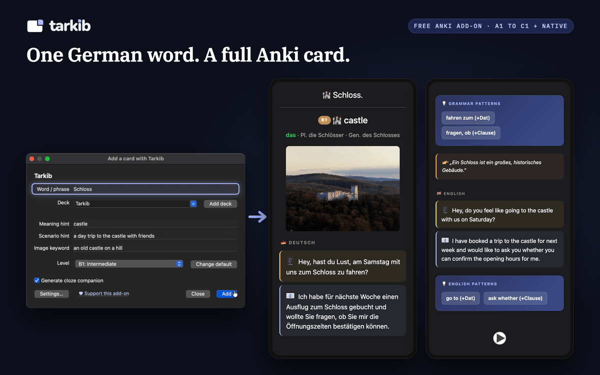
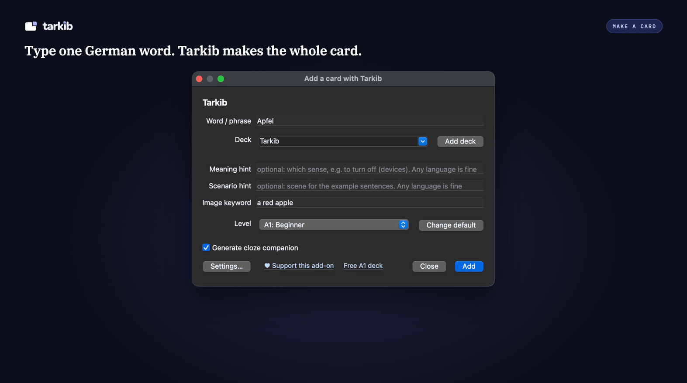
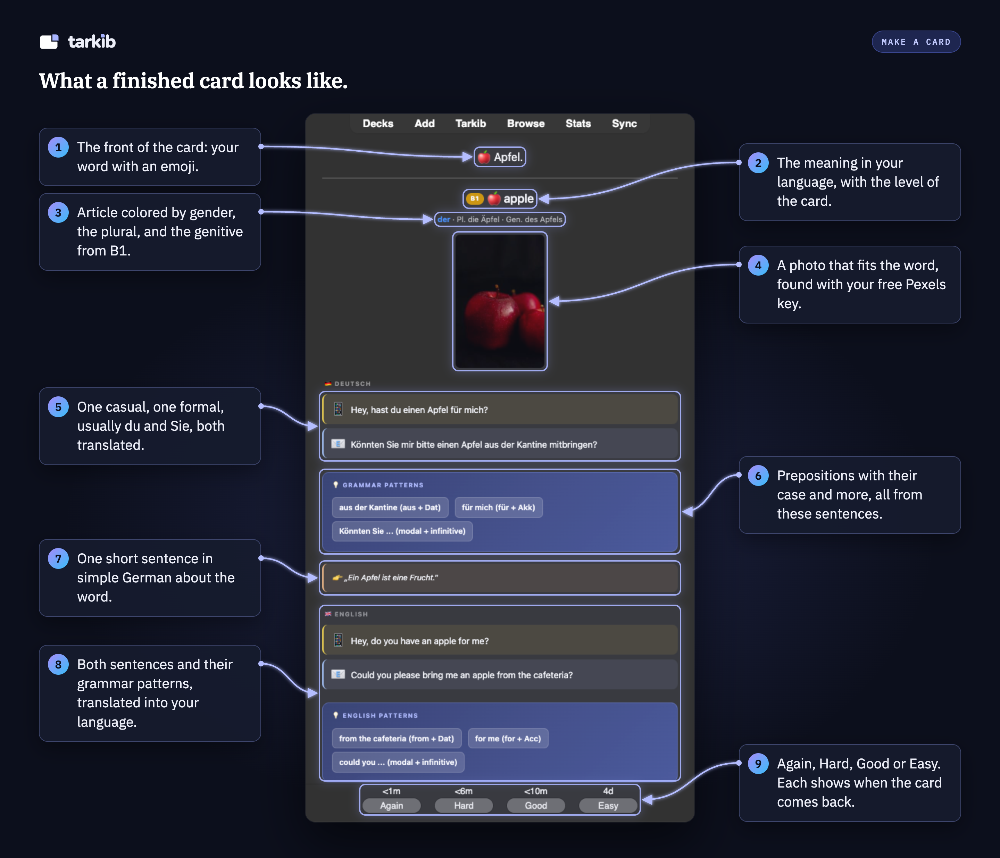

# Tarkib: AI German flashcards for Anki

### One German word. A complete, well-structured Anki card.

> A free, open-source Anki add-on that turns one typed word into a full language card: meaning and a natural translation, a related image, memory emojis, audio, a casual and a formal example sentence, and the grammar that actually matters.

## The story

I've been using Anki for a few years to learn languages, especially German. I found a card format that works for me. **Front:** the word. **Back:** the meaning, a related image, a couple of emojis that help me remember it, audio, and two example sentences, one casual and one formal. Verbs always come with their preposition and case, like "warten auf" with the Akkusativ, because that is what you need when you speak.

The problem was making those cards. I typed everything in by hand, made the audio with a separate TTS tool, searched for an image and uploaded it, then asked an AI if my example sentence was even correct. One card took me ten to fifteen minutes.

As a developer, I wanted to use that skill to build something that helps me with this. So I started planning and thinking about a tool that could do the slow parts for me, and after a while it turned into this add-on.

Now I type one word, pick the level (A1 to C1, or Native for real spoken German) and the language I want for the translation on the back, even a second one if I like. Tarkib builds the whole card with the image, audio, example sentences and grammar, plus a cloze card where I type the missing word, if I want one. I still check each card myself.

## How it works

1. Install it from [AnkiWeb](https://ankiweb.net/shared/info/83323714): in Anki, **Tools → Add-ons → Get Add-ons**, paste the code `83323714` and restart Anki.
2. Add your free keys in **Settings**: a Groq key writes the cards (free, no credit card), and a Pexels key adds the photos (free, optional). The [setup guide](https://tarkib-anki.pages.dev/docs/addon-install) shows every step with screenshots, about five minutes.
3. Open Tarkib with **Tools → "Add a card with Tarkib"**, `Ctrl+Shift+G`, or the Tarkib button in the editor, the Decks screen or the top toolbar. Type one German word or phrase, pick a deck and a level, and click **Add**. About 15 to 20 seconds later the card (and the optional cloze companion) is in your collection, with image and audio.

Create on the desktop, study anywhere: the cards are normal Anki notes and media, so they sync and study fully on AnkiDroid and iOS like any other deck. The generator runs on Anki Desktop only (the mobile apps do not run add-ons).

## What you get

Type one word, get a full card:

- **Meaning and a natural translation**, in your helper language.
- **A casual and a formal example sentence**, each translated, so you learn when to use the word, not just what it means.
- **The grammar learners actually trip on:** article, plural, and (from B1) genitive for nouns, the correct past forms of strong verbs, and for verbs the preposition with its case, like `warten auf` with Akkusativ.
- **A real image and a couple of memory emojis** tied to the word, so it has something to hook onto.
- **German audio**, so you hear how the word and the sentences sound. The translations are read aloud only if you turn on their voices in **Settings, Languages**.
- **An optional fill-in-the-blank (cloze) companion card**, to practice producing the word, not just recognizing it.
- **Sentences that match your level:** A1 to C1, plus a "Native" style for real spoken German.

## Translation languages

The helper text under the German can be any of **24 languages** (English by default). Optionally add a **second language** on every card, for example English plus Arabic for a bilingual learner.

Every language has a natural Microsoft voice. The translations stay silent until you pick their voices in **Settings, Languages**. Press **▶** next to a voice to hear a sample sentence before you decide.

## Ready-made German decks (A1 is free)

Rather not make the cards yourself? I made German decks, A1 to C1, in the same card format. Every word has a picture, German audio, casual and formal sentences, and the grammar pattern with its case when the sentence has one, like `fahren mit (+Dat)`. Nouns come with their article, and the plural when there is one. Nearly every word also has a typing card checked letter by letter. Meanings in English or Arabic. The cards were made with Claude, Anthropic's AI, then reviewed and fixed by a person, card by card, over several rounds. The audio comes from a licensed voice service, and the pictures are licensed too.

**[Get the whole A1 level for free](https://ko-fi.com/s/ab96fd15d8)** (305 word cards plus 304 typing cards). The English edition is also on [AnkiWeb Shared Decks](https://ankiweb.net/shared/info/255858872). Other levels are in [my Ko-fi shop](https://ko-fi.com/tarkib/shop). You could build them yourself with Tarkib, but A2 to C1 is 1,814 word cards: on the free Groq plan, which allows a few dozen cards a day, that takes well over a month, and every card still needs checking. The paid levels are those cards already made and reviewed.

## Cost, keys and privacy

Tarkib is free and open source, with no account and no server of mine in between. It runs on your own key. The default is a free model on Groq, enough for a few dozen cards a day, and OpenAI, Google Gemini, Anthropic, Mistral, OpenRouter or a local Ollama model work too.

Your keys stay on your computer, are never synced, and each one goes only to its own service. The German, and a translation only when its voice is on, goes to Microsoft's Edge read-aloud service for the audio. Nothing is sent to me. The read-aloud service is not an official API, so if it changes, cards are still made, only without sound.

## A note on quality

The cards are written by a language model, so they are occasionally wrong, mostly with rarer words. Treat each card as a draft you approve: look it over after it is added and edit it like any other note. That takes seconds. Building the card by hand took ten to fifteen minutes.

## Contributing

Contributions are welcome, **especially improving the cards for more languages and CEFR levels**. See **[CONTRIBUTING.md](CONTRIBUTING.md)** for the dev setup and where the prompt and level rules live (`pipeline/prompts.py`). Version history is in **[CHANGELOG.md](CHANGELOG.md)**, and what is planned next in **[ROADMAP.md](ROADMAP.md)**. The code was built with a lot of help from Claude, Anthropic's AI.

## Support

This add-on is free and stays free. If it saves you time, you can support its development:

**[♥ Support me on Ko-fi](https://ko-fi.com/tarkib)**

Buying one of the [ready-made decks](https://ko-fi.com/tarkib/shop) helps too.

Inside the add-on there is a small "♥ Support this add-on" link and a quiet "Free A1 deck" link in the window footer, which becomes "A1 to C1 decks" once you have one of the decks. A short thank-you appears three times, at 50, 200 and 500 cards, with a permanent "Don't show this again". After your fifth card, a short note about the ready-made decks appears inside the window on up to three openings, and its x hides it for good. At the bottom of the Settings "Cards" tab, one line points to the ready-made decks. While no AI key is set, the setup message also says that the free A1 deck needs no key.

## License

[MIT](LICENSE) © 2026 saadel123. Free to use, modify, and share.
